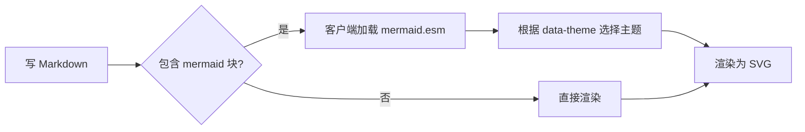
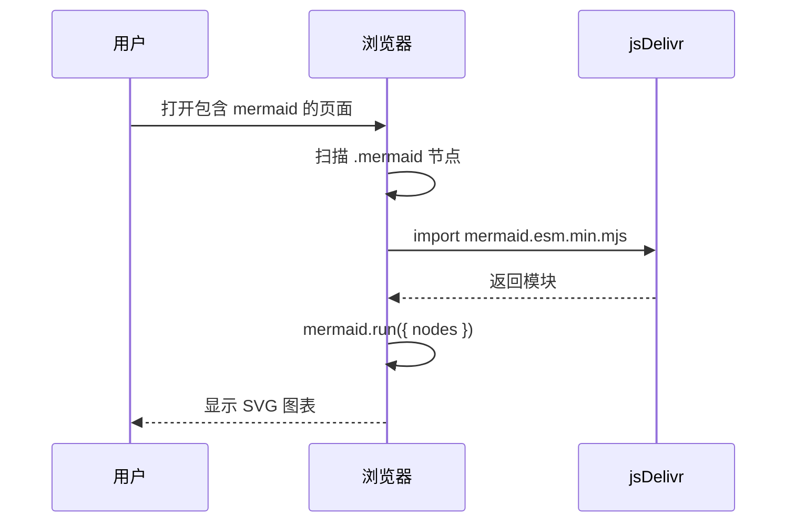
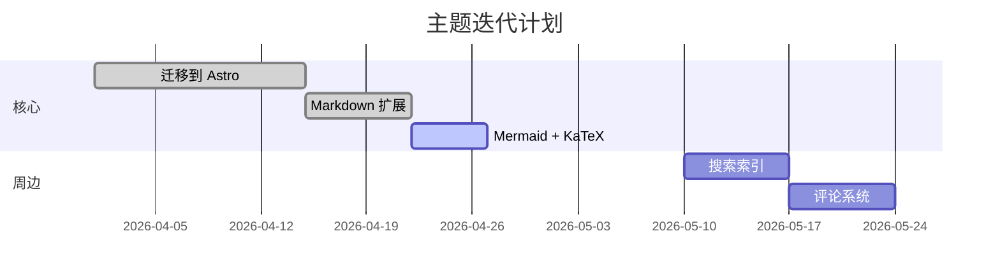
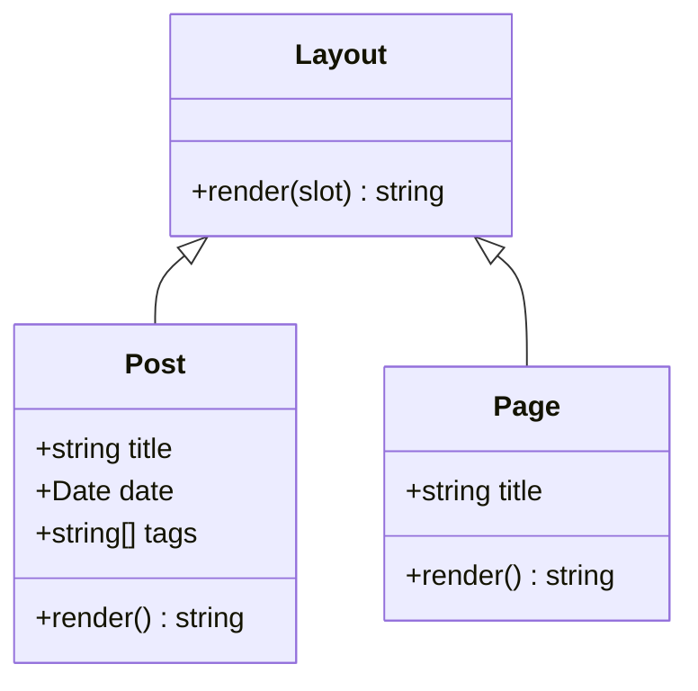
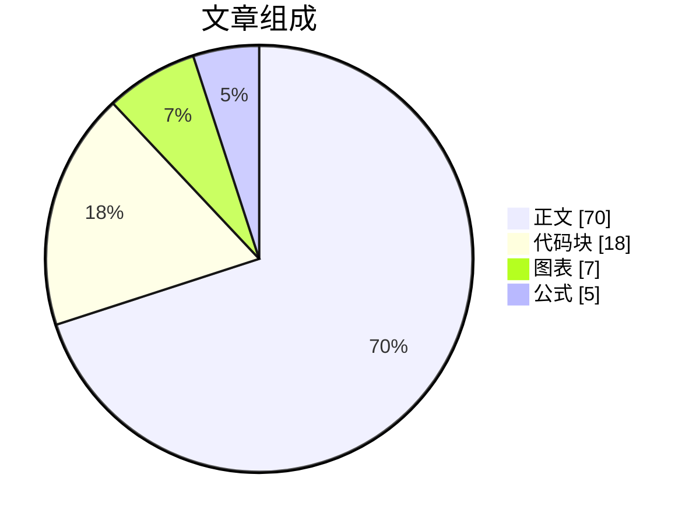
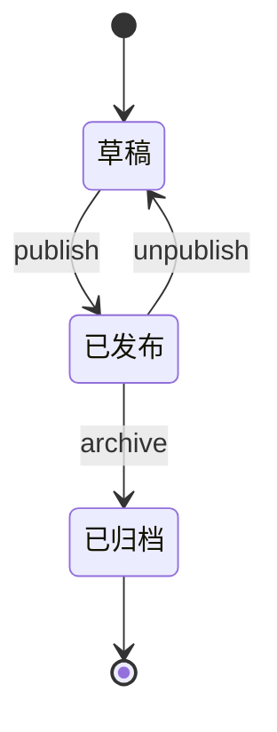

本文把主题支持的全部排版元素集中到一处,看完这一篇,你就能直接对照写自己的文章了。

## 一、Markdown 基础

### 1.1 标题与段落

不同层级的标题字号、粗细、留白都已调好,正文段落使用霞鹜文楷做中文字体兜底,西文用 Inter,等宽字体用 JetBrains Mono。

### 1.2 行内排版

包括 **加粗**、*斜体*、~~删除线~~、`行内代码`、[行内链接](https://github.com/fii6/colorful-geek),以及上标 H<sub>2</sub>O 与下标 E = mc<sup>2</sup>。

### 1.3 列表

无序列表:

- 第一项
- 第二项
  - 嵌套第二级
  - 同级再来一条
- 第三项

有序列表:

1. 安装依赖
2. 修改配置
3. 启动开发服务器
4. 部署到生产环境

任务清单:

- [x] 完成主题迁移
- [x] 写完介绍文章
- [ ] 接入评论系统
- [ ] 增加全文翻译

### 1.4 引用

> 简洁是终极的复杂。
> —— 达·芬奇

### 1.5 表格

| 功能 | 状态 | 备注 |
| :--- | :---: | ---: |
| Markdown | 完整支持 | 内置 |
| Mermaid | 完整支持 | 远端 ESM 按需加载 |
| KaTeX | 完整支持 | rehype-katex |
| 全文搜索 | 完整支持 | Pagefind |

### 1.6 GitHub 风格提示框

主题接入了 `remark-github-blockquote-alert`,五种语义都可以直接用。

> [!NOTE]
> 普通信息提示,适合补充说明。

> [!TIP]
> 小技巧,通常是非必需但能提升体验的做法。

> [!IMPORTANT]
> 关键信息,读者最好留意。

> [!WARNING]
> 潜在风险,可能导致非预期行为。

> [!CAUTION]
> 严重警告,可能造成数据损失或不可逆操作。

### 1.7 代码块

代码块由 expressive-code 渲染,自带行号、语言徽标、复制按钮。

```js title="hello.js" {3} ins={5} del={6}
function greet(name) {
  // 模板字符串
  return `Hello, ${name}!`;
  // 旧写法已废弃
  console.log(greet('Astro'));
  console.log("Hello, " + "Astro" + "!");
}
```

支持 shell 会话(自动隐藏行号):

```shellsession
$ npm install
added 327 packages in 12s
$ npm run dev
  ▶ Astro v5.0.0 dev server running at http://localhost:4321/
```

可折叠区段:

```ts collapse={3-7} title="config.ts"
export const config = {
  name: 'colorful-geek',
  options: {
    debug: false,
    cache: true,
    minify: true,
    sourcemap: false,
  },
};
```

### 1.8 分隔线

---

### 1.9 图片

```markdown

```

正文图片会自动接入 Fancybox,点击放大。

## 二、Mermaid 图表

只要在 Markdown 里写 ` ```mermaid ` 代码块,主题会在客户端按需加载 Mermaid 11,跟随当前主题(亮 / 暗)自动切换配色。

### 2.1 流程图



### 2.2 时序图



### 2.3 甘特图



### 2.4 类图



### 2.5 饼图



## 三、KaTeX 公式

主题在 Markdown 链路上接入了 `remark-math` + `rehype-katex`,样式表通过 `themeConfig.custom_css` 加载。

### 3.1 行内公式

爱因斯坦质能方程: $E = mc^2$ 是物理学最著名的公式之一;欧拉恒等式 $e^{i\pi} + 1 = 0$ 把五个最重要的常数联系到了一起。

### 3.2 块级公式

二次方程求根公式:

$$
x = \frac{-b \pm \sqrt{b^2 - 4ac}}{2a}
$$

高斯积分:

$$
\int_{-\infty}^{+\infty} e^{-x^2} \, dx = \sqrt{\pi}
$$

### 3.3 矩阵

$$
A = \begin{pmatrix}
a_{11} & a_{12} & a_{13} \\
a_{21} & a_{22} & a_{23} \\
a_{31} & a_{32} & a_{33}
\end{pmatrix}
$$

### 3.4 多行对齐

$$
\begin{aligned}
(x + y)^2 &= x^2 + 2xy + y^2 \\
(x - y)^2 &= x^2 - 2xy + y^2 \\
(x + y)(x - y) &= x^2 - y^2
\end{aligned}
$$

### 3.5 求和与极限

$$
\sum_{n=1}^{\infty} \frac{1}{n^2} = \frac{\pi^2}{6}
\qquad
\lim_{x \to 0} \frac{\sin x}{x} = 1
$$

### 3.6 分段函数

$$
f(x) =
\begin{cases}
x^2,        & x \geq 0 \\
-x,         & -1 \leq x < 0 \\
\text{undefined}, & x < -1
\end{cases}
$$

### 3.7 希腊字母与常用符号

$\alpha, \beta, \gamma, \delta, \epsilon, \zeta, \eta, \theta, \lambda, \mu, \pi, \sigma, \phi, \omega$
$\Alpha, \Beta, \Gamma, \Delta, \Theta, \Lambda, \Pi, \Sigma, \Phi, \Omega$
$\forall \, x \in \mathbb{R}, \exists \, y \in \mathbb{N}, \; y \geq x \Rightarrow y \to \infty$

## 四、组合示例

把表格、公式与 Mermaid 放在一起,验证排版互不打架。

| 算法 | 时间复杂度 | 空间复杂度 |
| --- | :---: | :---: |
| 二分查找 | $O(\log n)$ | $O(1)$ |
| 快速排序 | $O(n \log n)$ | $O(\log n)$ |
| 归并排序 | $O(n \log n)$ | $O(n)$ |



## 收束

至此,主题的 Markdown、Mermaid、KaTeX 渲染能力全部跑了一遍。

仓库地址:<https://github.com/fii6/colorful-geek>
